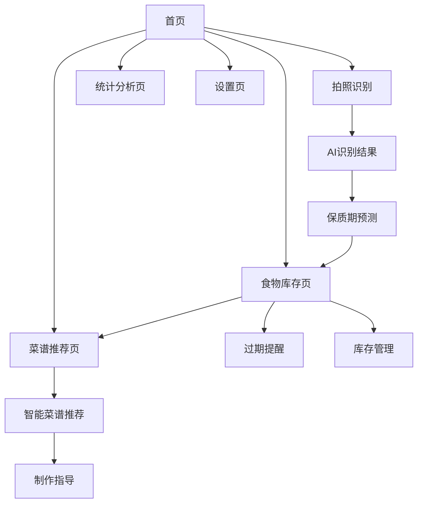

# 智能食物管理系统产品需求文档

## 1. 产品概览

基于Gemma 3n多模态AI技术的智能食物管理Web应用，通过拍照识别食物、预测保质期和推荐菜谱，帮助用户减少食物浪费，践行低碳环保生活方式。

本产品旨在解决家庭食物管理混乱、食材过期浪费的问题，为注重环保和健康生活的用户提供智能化的食物管理解决方案。

产品目标是参加Google Gemma 3n Impact Challenge比赛，通过技术创新推动可持续发展理念。

## 2. 核心功能

### 2.1 用户角色

| 角色 | 注册方式 | 核心权限 |
|------|----------|----------|
| 默认用户 | 无需注册，本地使用 | 可使用所有核心功能，数据本地存储 |

### 2.2 功能模块

我们的智能食物管理系统包含以下主要页面：

1. **首页**：相机拍照模块、食物识别展示、快速操作入口
2. **食物库存页**：分类展示列表、过期提醒、库存管理
3. **菜谱推荐页**：智能菜谱推荐、食材优先级提示、制作指导
4. **统计分析页**：食物浪费统计、环保贡献展示、使用数据分析
5. **设置页**：应用配置、数据管理、帮助说明

### 2.3 页面详情

| 页面名称 | 模块名称 | 功能描述 |
|----------|----------|----------|
| 首页 | 相机拍照模块 | 调用设备摄像头拍照，支持多张连拍，实时预览功能 |
| 首页 | AI食物识别 | 使用Gemma 3n识别图片中的食物类型、数量和新鲜度状态 |
| 首页 | 保质期预测 | 基于食物类型和视觉状态预测剩余保质期（蔬菜3-7天，水果7-14天，乳制品5-10天等） |
| 首页 | 快速添加 | 手动添加食物选项，语音输入支持 |
| 食物库存页 | 分类展示 | 按食物类型分类展示（蔬菜、水果、肉类、乳制品、调料等） |
| 食物库存页 | 过期提醒 | 颜色编码显示过期状态（绿色安全、黄色即将过期、红色已过期） |
| 食物库存页 | 库存管理 | 编辑食物信息、标记已消费、删除过期食物 |
| 菜谱推荐页 | 智能推荐 | 基于现有食材推荐可制作菜谱，优先使用即将过期食材 |
| 菜谱推荐页 | 制作指导 | 提供详细制作步骤、营养信息、预计用时 |
| 菜谱推荐页 | 食材优先级 | 显示哪些食材需要优先使用，减少浪费 |
| 统计分析页 | 浪费统计 | 记录和展示食物浪费情况，计算减少的碳排放 |
| 统计分析页 | 环保贡献 | 显示用户的环保成就，如减少的食物浪费量、节约的资源等 |
| 设置页 | 数据管理 | 本地数据备份、清理、导出功能 |
| 设置页 | 应用配置 | 提醒设置、语言选择、主题切换 |

## 3. 核心流程

**主要用户操作流程：**

1. **食物录入流程**：用户打开应用 → 点击拍照按钮 → 拍摄食物照片 → AI自动识别食物类型 → 系统预测保质期 → 用户确认或修改信息 → 保存到本地库存

2. **库存管理流程**：用户查看食物库存页 → 浏览分类食物列表 → 查看过期提醒 → 标记已消费食物或删除过期食物 → 更新库存状态

3. **菜谱推荐流程**：用户进入菜谱推荐页 → 系统分析当前库存 → 智能推荐可制作菜谱 → 优先显示使用即将过期食材的菜谱 → 用户选择菜谱查看制作步骤

## 4. 用户界面设计

### 4.1 设计风格

- **主色调**：环保绿色(#4CAF50)作为主色，温暖橙色(#FF9800)作为强调色
- **按钮样式**：圆角矩形按钮，具有轻微阴影效果，支持按压反馈
- **字体**：主标题使用18px粗体，正文使用14px常规字体，确保移动端可读性
- **布局风格**：卡片式设计，顶部导航栏，底部标签栏导航
- **图标风格**：使用线性图标配合填充图标，食物相关使用彩色emoji增强视觉效果

### 4.2 页面设计概览

| 页面名称 | 模块名称 | UI元素 |
|----------|----------|--------|
| 首页 | 相机拍照模块 | 大型圆形拍照按钮(绿色，居中)，相机预览框，闪光灯控制 |
| 首页 | AI识别展示 | 识别结果卡片，食物图标，置信度进度条，编辑按钮 |
| 食物库存页 | 分类展示 | 横向滑动分类标签，垂直食物卡片列表，搜索框 |
| 食物库存页 | 过期提醒 | 颜色编码圆点，倒计时数字，过期警告图标 |
| 菜谱推荐页 | 智能推荐 | 菜谱卡片网格布局，食材匹配度标签，收藏按钮 |
| 菜谱推荐页 | 制作指导 | 步骤时间轴，食材清单，营养信息图表 |
| 统计分析页 | 环保贡献 | 环形进度图，成就徽章，数据可视化图表 |
| 设置页 | 应用配置 | 开关按钮，下拉选择器，滑动条，帮助链接 |

### 4.3 响应式设计

产品采用移动端优先的响应式设计，支持手机、平板和桌面端使用。针对触摸交互进行优化，按钮尺寸不小于44px，支持手势操作如滑动删除、长按编辑等。