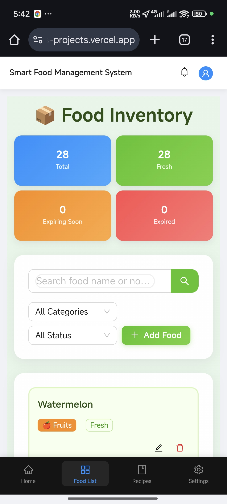
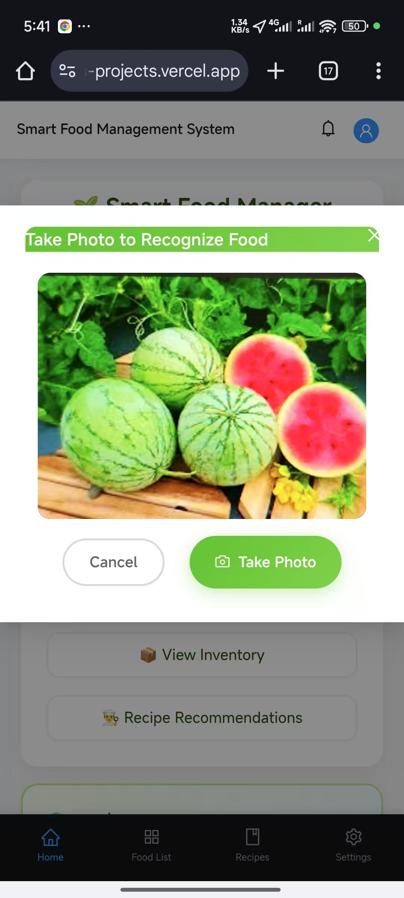
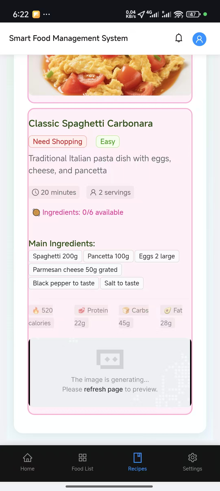

# Smart Food Management System

## 🌐 Live Demo

**Experience the app now:** [https://traegemmaa8pw1-nda3l1hu5-asdfasdf3s-projects.vercel.app/](https://traegemmaa8pw1-nda3l1hu5-asdfasdf3s-projects.vercel.app/)

## 📱 App Screenshots

<div align="center">

### Homepage - Smart Food Manager


### Photo Recognition Feature


### Recipe Recommendations



</div>

## 🌟 Project Overview

The Smart Food Management System is an AI-powered web application built with React and TypeScript that helps users manage their food inventory intelligently, reduce food waste, and contribute to environmental sustainability. Powered by the Gemma AI model, this system provides intelligent food recognition, expiry tracking, and personalized recipe recommendations.

## 🚀 Key Features

### 🤖 AI-Powered Food Recognition
- **Smart Camera Integration**: Take photos of food items for instant AI recognition
- **Multi-Food Detection**: Identify multiple food items in a single image
- **High Accuracy**: Advanced AI model with confidence scoring for reliable results
- **Manual Editing**: Review and edit AI recognition results before saving

### 📱 Comprehensive Food Management
- **Digital Inventory**: Maintain a complete digital record of your food items
- **Expiry Tracking**: Automatic expiry date monitoring with smart alerts
- **Category Organization**: Organize foods by categories (vegetables, fruits, meat, dairy, etc.)
- **Location Tracking**: Track where items are stored (refrigerator, pantry, freezer)
- **Quantity Management**: Monitor quantities and units for each food item

### 👨‍🍳 Intelligent Recipe Recommendations
- **AI-Generated Recipes**: Get personalized recipe suggestions based on available ingredients
- **Cultural Diversity**: Random recommendations featuring both Western and Eastern cuisines
- **Ingredient Optimization**: Prioritize recipes that use ingredients nearing expiry
- **Difficulty Levels**: Recipes categorized by cooking difficulty (Easy, Medium, Hard)
- **Nutritional Information**: Calorie and macronutrient details for each recipe

### 📊 Smart Analytics & Insights
- **Expiry Alerts**: Real-time notifications for foods approaching expiry dates
- **Waste Reduction Tracking**: Monitor your food waste reduction progress
- **Environmental Impact**: Calculate your carbon footprint reduction
- **Usage Statistics**: Detailed insights into your food consumption patterns

### 🎨 Modern User Experience
- **Responsive Design**: Seamless experience across desktop, tablet, and mobile devices
- **Intuitive Interface**: Clean, modern UI with easy navigation
- **Dark/Light Theme**: Customizable appearance preferences
- **Multi-language Support**: Available in English and Chinese

## 🌍 Environmental Impact & Sustainability

### 🌱 Contributing to a Greener Planet

Our Smart Food Management System is designed with environmental sustainability at its core. By helping users reduce food waste, we're making a significant contribution to global environmental protection:

#### 💧 Water Conservation
- **1,000 liters of water saved** per kilogram of food waste prevented
- Reduces the environmental burden of agricultural water consumption
- Helps preserve this precious natural resource for future generations

#### ⚡ Energy Efficiency
- **2.5 kWh of energy saved** per kilogram of food waste reduced
- Decreases the carbon footprint of food production and transportation
- Contributes to reduced greenhouse gas emissions

#### 🌾 Land Preservation
- **0.5 square meters of agricultural land saved** per kilogram of food waste prevented
- Reduces pressure on natural ecosystems and biodiversity
- Supports sustainable land use practices

#### 🌡️ Carbon Footprint Reduction
- **Tracks CO₂ savings** based on different food categories
- Provides real-time feedback on environmental impact
- Encourages sustainable consumption habits

### 🎯 Our Mission: "Cherish Food, Live Low-Carbon, Protect the Environment"

Every food item saved from waste is a step toward:
- **Reducing global food waste** (currently 1.3 billion tons annually)
- **Fighting climate change** through reduced agricultural pressure
- **Promoting sustainable living** in our daily routines
- **Building awareness** about the environmental cost of food waste

## 🛠️ Technology Stack

- **Frontend**: React 18 + TypeScript
- **UI Framework**: Ant Design
- **Styling**: Tailwind CSS
- **State Management**: Zustand
- **Routing**: React Router
- **AI Integration**: Gemma AI Model
- **Build Tool**: Vite
- **Data Storage**: IndexedDB (via browser storage)

## 🚀 Getting Started

### Prerequisites
- Node.js (v16 or higher)
- npm or pnpm package manager

### Installation

1. **Clone the repository**
   ```bash
   git clone <repository-url>
   cd smart-food-management
   ```

2. **Install dependencies**
   ```bash
   npm install
   # or
   pnpm install
   ```

3. **Start the development server**
   ```bash
   npm run dev
   # or
   pnpm dev
   ```

4. **Open your browser**
   Navigate to `http://localhost:5173` to start using the application

### Building for Production

```bash
npm run build
# or
pnpm build
```

## 📱 How to Use

1. **Add Food Items**
   - Use the camera to take photos of your food
   - Let AI recognize and categorize items automatically
   - Review and edit details as needed
   - Save to your digital inventory

2. **Monitor Expiry Dates**
   - Receive alerts for foods nearing expiry
   - View your inventory organized by freshness status
   - Take action to use items before they expire

3. **Get Recipe Recommendations**
   - Generate AI-powered recipe suggestions
   - Use ingredients you already have
   - Discover new cuisines and cooking techniques
   - Reduce waste by using expiring ingredients first

4. **Track Your Impact**
   - Monitor your environmental contributions
   - See real-time statistics on waste reduction
   - Celebrate your positive impact on the planet

## 🤝 Contributing to Environmental Sustainability

By using this Smart Food Management System, you're joining a global movement to:

- **Reduce food waste** and its environmental impact
- **Promote sustainable consumption** habits
- **Raise awareness** about food waste issues
- **Contribute to climate action** through individual choices
- **Build a more sustainable future** for generations to come

## 📄 License

This project is open source and available under the [MIT License](LICENSE).

## 🙏 Acknowledgments

- **Gemma AI Team** for providing the powerful AI model
- **Environmental organizations** inspiring our sustainability mission
- **Open source community** for the amazing tools and libraries
- **Users** who choose to make a difference through conscious food management

---

**Together, we can make a difference. Every meal saved is a step toward a more sustainable planet. 🌍💚**